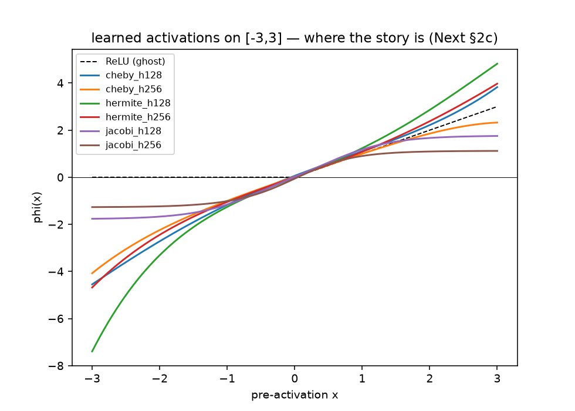
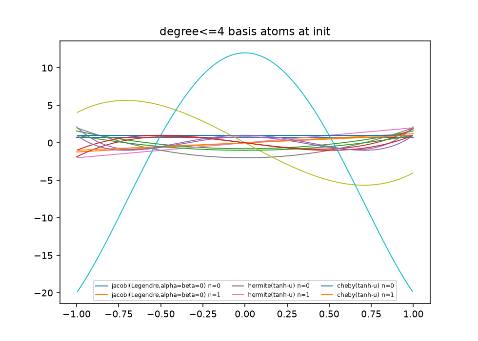
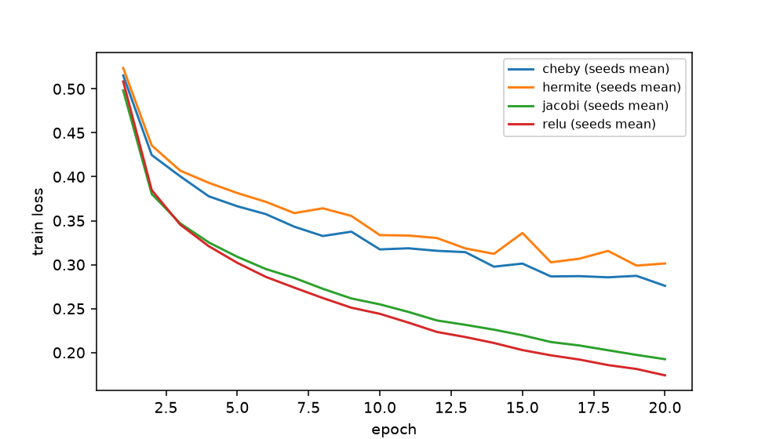

```{python}
#| echo: false
from __future__ import annotations

import json
from pathlib import Path

import polars as pl
import pandas as pd
from great_tables import GT, md


def _root() -> Path:
    here = Path.cwd()
    for cand in [here, *here.parents]:
        if (cand / "results" / "exp8_summary.parquet").exists():
            return cand
    raise RuntimeError(
        "results/exp8_summary.parquet not found: run `python compare.py --report` "
        "first (the site renders from local artifacts; it never re-runs the study)")


RES = _root() / "results"
df = pl.read_parquet(RES / "exp8_summary.parquet")
summary = json.loads((RES / "exp8_summary.json").read_text())
band = json.loads((RES / "noise_band.json").read_text())
tails = json.loads((RES / "relu_tail.json").read_text())


def stats(h: int) -> list[dict]:
    out = []
    for arm in ("relu", "jacobi", "hermite", "cheby"):
        v = df.filter((pl.col("hidden") == h) & (pl.col("arm") == arm))
        acc = v["acc_pct"].to_list()
        mean = sum(acc) / len(acc)
        sd = (sum((a - mean) ** 2 for a in acc) / (len(acc) - 1)) ** 0.5
        ab = [a for a in v["alpha"].to_list() if a is not None]
        bb = [b for b in v["beta"].to_list() if b is not None]
        out.append({
            "arm": {"relu": "A-relu", "jacobi": "A-jacobi", "hermite": "A-hermite", "cheby": "A-cheby"}[arm],
            "acc": f"{mean:.2f}", "sd": f"{sd:.2f}",
            "params": f"{int(v['params'][0]):,}",
            "ab": f"{sum(ab)/len(ab):.2f} / {sum(bb)/len(bb):.2f}" if ab else "—",
            "sec": f"{v['secs_per_epoch'].mean():.1f}",
            "div": str(int(v["diverged"].sum())),
        })
    return out
```

## Protocol (frozen before epoch zero)

The full pre-registration lives in
[`docs/PREREG.md`](https://github.com/math4mad/Polynomial-Activated-NN/blob/a3adf21/docs/PREREG.md),
committed **before any epoch ran** — with an append-only amendment log (§7). In
one paragraph: one hidden layer 784→h→10, widths {128, 256}, degree d = 4
(5 coefficients per neuron, *billed as architecture*), Adam lr 1e-3, batch 64,
20 epochs, final-epoch model, 5 paired seeds {{1000…1004}}, canonical Fashion-MNIST
split pinned in `data.py`, bytes hash-pinned in the shared `chora` manifest.
The comparison is **equal total parameters**: poly arms cost $800h+12$, the ReLU
arm is width-matched to within 1% (same $h$ is 0.63% off).

Arms: **A-jacobi** $\phi(x)=\sum_k c_k\hat P_k^{(\alpha,\beta)}(\tanh x)$ with
per-neuron $c_k$ and per-layer learned $(\alpha,\beta)$ (softplus-admissible,
Legendre init); **A-hermite** $\sum_k c_k H_k(x)$ and **A-cheby** $\sum_k c_k T_k(x)$
raw — *no squashing, no normalization rescue*: if they explode, that is the result.
The Jacobi recurrence is ported from `JacobiGP@f181923:src/jacobigp/basis.py`
(blob `597d1fea…`) and verified against `scipy.special` (10/10 tests:
scipy-equality, Gram $=\mathbb{I}$ on five $(\alpha,\beta)$ including the Chebyshev
pole line, finite $\partial/\partial\alpha$).

### The noise band

Calibration ran first: 20 of the 40 cells, after which the claim band was fixed —
the provisional ±0.3 pp rule died exactly as designed:

```{python}
#| echo: false
print(f"observed max within-arm seed sd = {band['observed_max_seed_sd_pp']:.3f} pp "
      f"> 0.15 pp  ⇒  adopted band = 2·sd = ±{band['adopted_band_pp']:.3f} pp, "
      "fixed before the remaining 20 runs.")
```

## The matrix

Every recorded cell, no drops. Test accuracy %, 5 seeds; A/B letters per pre-registered prediction below.

```{python}
#| echo: false
def table(h):
    return (GT(pd.DataFrame(stats(h)))
            .cols_label(arm="arm", acc=md("test acc %"), sd="sd", params="total params",
                        ab=md("learned α / β"), sec="s / epoch", div="diverged")
            .tab_options(table_font_size="0.9em"))
```

:::columns
:::column
##### h = 128

```{python}
#| echo: false
table(128)
```
:::
:::column
##### h = 256

```{python}
#| echo: false
table(256)
```
:::
:::

## Verdicts against the predictions

::: {.callout-success}
### P-shape: the load-bearing half holds
Jacobi ≥ Hermite by **+1.15 pp** (h=128) and **+1.75 pp** (h=256) — both beyond
the ±0.938 pp band, at both widths, never averaged across widths to rescue.
The family with built-in boundaries, on the domain that matches a bounded
activation, wins per parameter. JacobiGP, your prediction survives its first test.
:::

::: {.callout-note}
### Hermite vs Cheby: indistinguishable, and we say so
+0.27 pp at h=128, −0.35 pp at h=256 — inside the band at both widths. Neither
claimed nor killed; Hermite's 1.00 pp seed sd at h=256 is the largest variance
in the table: raw arms don't explode to NaN, they explode to *noise*
($|\phi|$ reaches 150–230 on $[-5,5]$ after training).
:::

::: {.callout-warning}
### P-eff: killed — by us, exactly as pre-registered
A total-parameter-matched ReLU matches or beats every poly arm at both widths
(gaps 0.64–2.19 pp). **"50–70% fewer parameters at equal accuracy" is retired**
at d=4 on a 10⁵-parameter MLP: bandlimiting is not free; the smoothness the
container buys costs more than the kink it removes. First-class negative result.
:::

## What the shape knob learned

::: figures
::: {#fig-acts caption="Learned activations on [-3,3] (per-neuron coefficients averaged over neurons; ReLU ghost dashed). The squashed Jacobi arm stays bounded; the raw arms keep their degree-4 wiggle at large |x|."}

:::
:::

$(\alpha,\beta)$ started at Legendre $(0,0)$ and walked to ≈ **(0.40, 0.37)** in
*every seed* — a positive-$(\alpha,\beta)$ preference: the Jacobi weight
$(1-x)^\alpha(1+x)^\beta$ *vanishing* at the edges of the squashed domain. The
neuron spends its boundary flexibility exactly where $\tanh$ already saturates —
Exp 1's edge behavior, interiorized, and the cleanest echo across benches the
programme could ask for: the GP's evidence optimizer and per-neuron coefficients,
two scales apart, dislike the same edges.

::: figures
::: {#fig-basis caption="The degree<=4 atoms at init: orthonormal Legendre (basis of the squashed arm) — the bandlimited container, by construction."}

:::
:::

## The spectral row, GPU-free (P-relu-tail)

How non-bandlimited is ReLU? Best degree-$d$ polynomial approximation of ReLU
on $[-3,3]$, relative error, vs the classical $\sim 0.28/d$ asymptotics:

```{python}
#| echo: false
rows = [r for r in tails["rows"] if r["degree"] in (2, 4, 6, 8, 12, 16)]
(GT(pd.DataFrame({k: [r[k] for r in rows] for k in ("degree", "rel_err", "predicted_0p28_over_d", "ratio_to_prediction")}))
 .cols_label(degree="d", rel_err="rel. error", predicted_0p28_over_d=md("0.28/d"),
             ratio_to_prediction="ratio")
 .fmt_number(columns=["rel_err", "predicted_0p28_over_d", "ratio_to_prediction"], decimals=3)
 .tab_options(table_font_size="0.9em"))
```

The ratio walks to 1.0: confirmed. At d=4 ReLU leaves **5.9%** of its range
uncaptured by *any* degree-4 polynomial — that is the tail our arms pay to
remove, and this note's tables price that removal at 0.6–2.2 pp of accuracy.

::: figures
::: {#fig-curves caption="Training loss, h=128, seeds averaged: ReLU descends fastest per epoch; the jacobi arm pays ~2.7x per-epoch compute (basis-table construction) and lands ~0.8pp behind, inside the band."}

:::
:::

## Compute, measured not feared

Whole 40-cell matrix on the shared M1 Pro (MPS): **≈ 85 min**. Letter 004's
"under an hour" missed by 1.5×, and the estimate now carries an error bar —
mean per-epoch wall-clock across all 40 runs:

```{python}
#| echo: false
mspe = summary["wall_clock"]["mean_secs_per_epoch"]
print(f"<p><b>{mspe:.2f} s / epoch</b> — still the programme's cheapest bench.</p>")
```

## Reproduce

```bash
python -m unittest tests.test_basis -v          # the port, verified against scipy
python train.py --arm jacobi --hidden 128 --seed 1000 --epochs 20   # one cell
python compare.py --calibration                 # band fixed before scoring
python compare.py --phase remaining && python compare.py --report
python visualize.py                             # figures + relu_tail row
```

Anchors: protocol `PolyNN@a3adf21` · code `PolyNN@33afdb8` · results
`PolyNN@548855e` · shared bytes in `chora` manifests
(`artifacts/results/polynn/exp8_summary.json` `b3eaccf6e366…`,
`noise_band.json` `e685bce134ce…`, `relu_tail.json` `eaa03a2d09a2…`).
Correspondence: Letters 004 → 005 → 006 in `docs/LETTERS/`.
